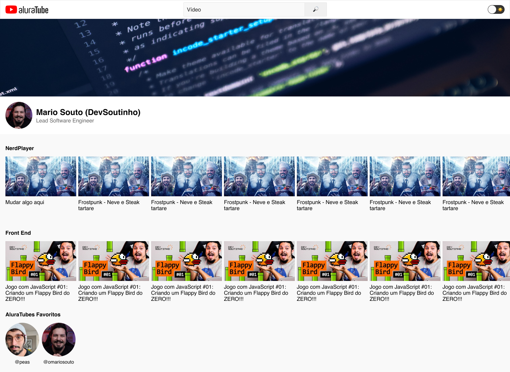

<h1 align="center"> Project Alura </h1>

Evento exclusivo e gratuito, promovido pela Alura para ensino de tecnologias WEB.

  <a href="#-tecnologias">Tecnologias</a>&nbsp;&nbsp;&nbsp;|&nbsp;&nbsp;&nbsp;
  <a href="#-projeto">Projeto</a>&nbsp;&nbsp;&nbsp;|&nbsp;&nbsp;&nbsp;
  <a href="#-layout">Layout</a>&nbsp;&nbsp;&nbsp;|&nbsp;&nbsp;&nbsp;
  <a href="#memo-licença">Licença</a>

  

 

  

## 🚀 Tecnologias

Esse projeto foi desenvolvido com as seguintes tecnologias:

- HTML e CSS
- JavaScript e JSON
- [Node e NPM](https://nodejs.org/)
- [React](https://reactjs.org/)

## 💻 Projeto

O AluraTub é um site baseado no Youtube, onde realiza grande parte das funcionalidades do mesmo.

## 🔖 Layout

Você pode visualizar o layout do projeto através [DESSE LINK](https://www.figma.com/file/1acrju7CLwHkSh6e7xEk9h/Aluratube?node-id=5%3A19&t=sAv8D2t3FFRy3YBq-0). É necessário ter conta no [Figma](https://figma.com) para acessá-lo.

## :memo: Licença

Esse projeto está sob a licença MIT.
